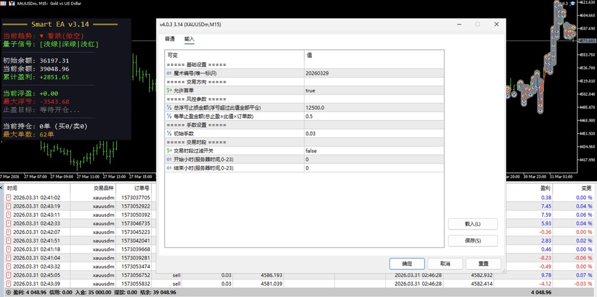
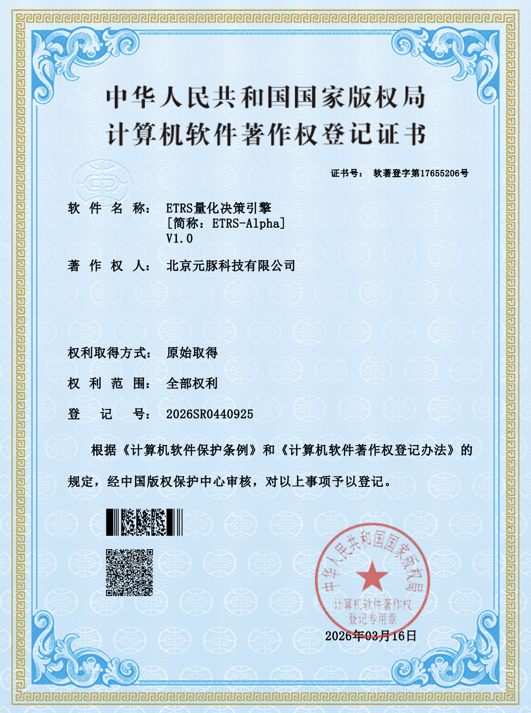

SmartEA经历了多个阶段的重构和优化，包括轻马丁的结合，我们对整个交易策略进行整体的优化，同时融合我们自己的算法和指标，发现策略有明显的优化，特别是针对特殊行情下，它的适应能力更强，稳定性更高，所以就给它放出来有偿内部测试，过程经历了 3 笔赔付，大概在 1.5w 左右，因为我们主要做的是 0 损+即时算法赔付的业务，保障投资人权益，这也是我们和其它工作室、公司不一样的地方。当然，现在策略依然还是有偿试用、有偿使用，所以免费要白嫖的别来找了，不免费。因为之前我们掏了很多钱做实验，大家海涵。

## 策略说明
1. 策略主要出现赔付的行情在 CPI，非农，特殊专家讲话时，其它行情顺畅通过。
2. 策略主要针对 XAUUSDm 或者 XAUUSDc 都是可以的，点差越低越好。
3. 策略不怕延迟，包括延迟 500ms 都是可以的。
4. 策略融合了一个ETRS 的算法，这个算法我还在申请专利，软著下来了，在用这个 EA的时候会用到这个算法，它的能力足够强。
5. 日收益在 3000-5000 这个范围，如果是美分账户就是 30-50U，最大 3000-4000 浮亏左右。
6. 整体顺势为主，组合 ETRS 的顺势策略，单指标策略。

## 策略运行截图

## 软著

